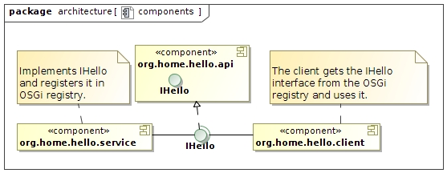
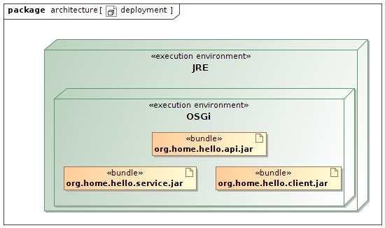
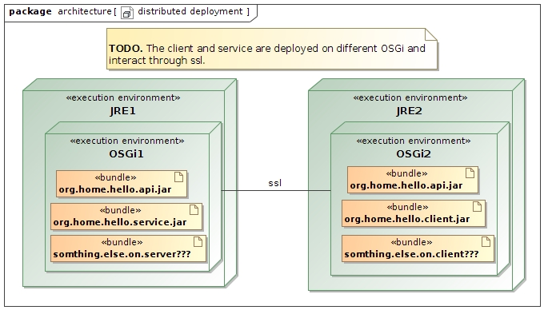
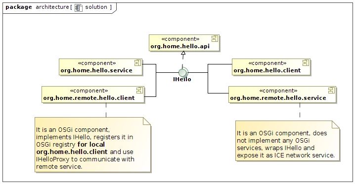
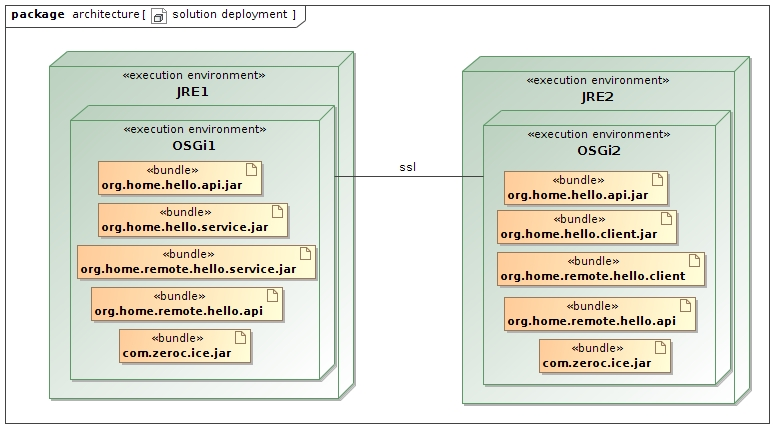

#Using ZeroC ICE in OSGi environment example.
The main idea is that a servant can have access to the OSGi registry. Therefore, it can use standard and user-defined OSGi services. In the example below, the servant uses (implicitly) the standard ConfigAdmin service and the user-defined service IHello.
##Use case.
There is an IHello service and a client using this service. See diagrams.

Requirement.

Solution.

##How to run.
###Run from Eclipse.
You need to install:
1. [OpenJDK](https://jdk.java.net/12/)
2. [Eclipse](https://www.eclipse.org/)
3. [Bndtools](https://bndtools.org/) I use [The development snapshot](https://bndtools.jfrog.io/bndtools/update)
4. [slice2java](https://zeroc.com/downloads/ice/3.7/java) compiler
5. [Ice builder for Eclipse](https://marketplace.eclipse.org/content/ice-builder-eclipse)

This git is bndtools workspace. Clone or download it. Create new Eclipse workspace, open bndtools perspective, import bndtools workspace from git. Now go to org.home.hello.run project. *etc* directory contains keystores and truststores for distributed server and client, *load* directory contains configurations for distributed server and client. _*.bndrun_ files have self-describing names.

###Run from command line.
TODO.